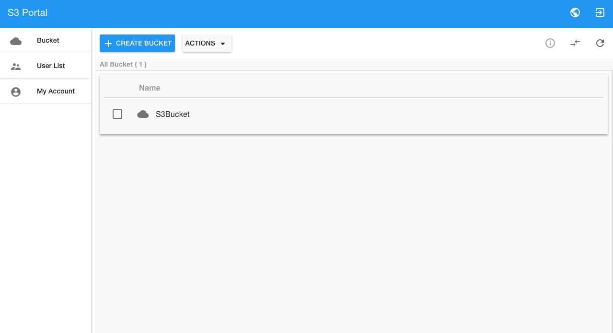

# Containerize Ceph S3 Portal
|              | S3 Portal API | S3 Portal UI |
|--------------|---------------|--------------|
| Build Status |[](https://hub.docker.com/r/inwinstack/s3-portal-api/)|[](https://hub.docker.com/r/inwinstack/s3-portal-ui/)|

This project is an dockerize and kubernetize for [S3 Portal](https://github.com/inwinstack/s3-portal-ui).



### Docker Compose Quick Start
Following the below steps to create application.

Requirement:
* Docker engine.
* Docker compose tool.

First, Set the environment variables in `docker-compose.yml`, For example:
```yml
db:
  image: mysql:5.6
  container_name: db
  environment:
    MYSQL_DATABASE: ceph
    MYSQL_ROOT_PASSWORD: "root"
backend:
  image: inwinstack/s3-portal-api:dev
  container_name: s3-api
  links:
    - db:db
  environment:
    S3_ACCESS_KEY: "<ADMIN_ACCESS_KEY>"
    S3_SECERT_KEY: "<ADMIN_SECERT_KEY>"
    S3_URL: "<S3_URL>"
    S3_PORT: "<S3_PORT>"
    S3_ADMIN_ENRTYPOINT: "<RADOSGW_ADMIN_ENRTYPOINT>"
    CEPH_REST_API_PORT: "<CEPH_REST_API_PORT>"
  ports:
    - 8080:80
frontend:
  image: inwinstack/s3-portal-ui:dev
  container_name: s3-ui
  environment:
    API_HOST: "<S3_API_URL>"
  ports:
    - 80:3000
```
> The `S3_ACCESS_KEY` and `S3_SECERT_KEY` account must be admin caps, follow as command to set in rgw:
```sh
$ radosgw-admin caps add --uid="<admin_uid>" --caps="users=*"
```
> Other caps options：
```
--caps="[users|buckets|metadata|usage|zone]=[*|read|write|read, write]"
```

Now, just run this command to deploy:
```sh
$ docker-compose up
```

### Kubernetes Quick Start
Requirement:
* Build a Kubernetes cluster.
* Deploy Kubernetes DNS service.
* Deploy [Ceph on Kubernetes](https://github.com/ceph/ceph-docker/tree/master/examples/kubernetes) or External Ceph.

First we need create a database application to store data:
```sh
$ echo -n "1f2d1e2e67df" > ./password.txt
$ kubectl create secret generic mysql-pass --from-file=password.txt
$ kubectl create -f mysql-dp.yml -f mysql-svc.yml
```

Then, use `portal-api-dp.yml` and `portal-api-svc.yml` files to create a S3 Portal API service:
```sh
$ kubectl create -f portal-api-dp.yml -f portal-api-svc.yml
```
> P.S. The file need to rewrite content for your need.

Finally, use `portal-ui-dp.yml` and `portal-ui-svc.yml` files to create S3 Portal UI service:
```sh
$ kubectl create -f portal-ui-dp.yml -f portal-ui-svc.yml
```
> P.S. The file need to rewrite content for your need.
